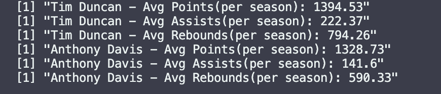
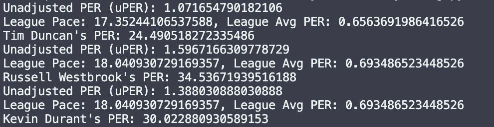
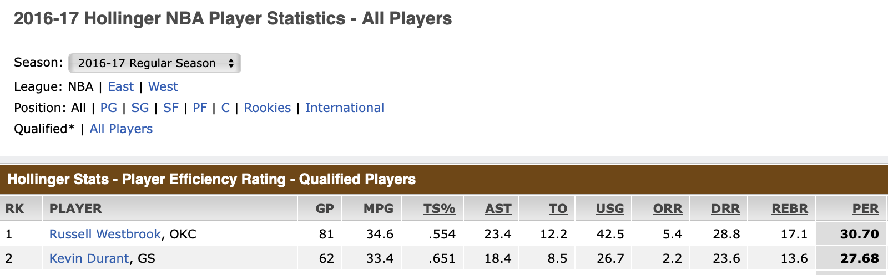

# Tim Duncan vs. Anthony Davis Analysis - "You Have No Idea How Good Tim Duncan Was"

## Table of Contents
- [Introduction](#introduction)
- [Methods and Technologies](#methods-and-technologies)
- [Preface](#preface)
- [Basic Stats](#basic-stats)
- [Shooting Analysis](#shooting-analysis)
- [Advanced Metrics](#advanced-metrics)
- [Conclusion](#conclusion)
- [Appendix](#appendix)

## Introduction
A video has started to go viral recently of a group of guys talking about basketball, one of them suggests that Anthony Davis is a better version of Tim Duncan and almost immediately another guy yells out in pure disappointment "You have no idea how good Tim Duncan was." Here I am going to try to prove that Tim Duncan is indeed better than this poor guy thinks he is, using data analytics and statistical analysis.

## Methods and Technologies
**Methods Used:**
- Descriptive Statistics
- Inferential Statistics
- Data Visualization
- Predictive Modeling

**Technologies:**
- Python
- R
- pandas
- ggplot2

## Preface
"...now remove the points, lets talk just about their game - their offensive game. bro. Anthony Davis. 3 point shot, mid range, can put the ball on the floor, he can do turnarounds, he has one of the best footworks inside the NB-"

"YOU HAVE NO IDEA HOW GOOD TIM DUNCAN WAS OH MY GOD I CANT BELIEVE I AM HEARING THIS"

## Python Script for NBA Stats Data Aquisition 
To begin the analysis, I wrote a script called `StatGrab.py` to fetch and compile career statistics for all NBA players using the NBA API. This script retrieves player data, processes it, and saves the results to a CSV file. It also includes functionality to save progress periodically to avoid data loss in case of interruptions.


### Key Functions and Code Snippets

### Import Necessary Libraries
Imports the required libraries for data fetching and processing.

```python
from nba_api.stats.static import players 
from nba_api.stats.endpoints import playercareerstats
import pandas as pd
import time  # to prevent against hitting API limits
import os
```

### Get All Players
```python
# Get all players
all_players = players.get_players()
```

### Initialize Data Structures
```python
# Initialize an empty list to hold the data frames
all_players_stats = []

# Load progress if exists
if os.path.exists('progress.csv'):
    progress_df = pd.read_csv('progress.csv')
    processed_players = set(progress_df['PLAYER_ID'])
    all_players_stats.append(progress_df)
else:
    processed_players = set()

```
### Fetch Career Stats for Each Player
```python
# Loop through each player and get their career stats
for player in all_players:
    if player['id'] in processed_players:
        continue
    try:
        player_id = player['id']
        player_stats = playercareerstats.PlayerCareerStats(player_id=player_id).get_data_frames()[0]
        player_stats['PlayerName'] = player['full_name']
        player_stats['PLAYER_ID'] = player_id
        all_players_stats.append(player_stats)
        print(f"Retrieved stats for {player['full_name']}")

        total_processed = len(all_players_stats) - 1 + len(processed_players)
        percentage = int(total_processed / len(all_players) * 100)
        print("item: ", total_processed, "of", len(all_players), " ", percentage, "%")
        
        # Save progress periodically
        if len(all_players_stats) % 100 == 0:
            progress_df = pd.concat(all_players_stats, ignore_index=True)
            progress_df.to_csv('progress.csv', index=False)
            print("Progress saved")
        
        time.sleep(0.5)  # Increase sleep time to avoid rate limits
    except Exception as e:
        print(f"Could not retrieve stats for player {player['full_name']}: {e}")
        time.sleep(5)  # Wait longer before retrying
```

### Combine and Save Data
```python
# Combine all player stats into a single DataFrame
combined_stats = pd.concat(all_players_stats, ignore_index=True)

# Save the combined stats to a CSV file
combined_stats.to_csv('combined_stats.csv', index=False)

# Remove progress file after completion
if os.path.exists('progress.csv'):
    os.remove('progress.csv')
```

## Raw Data from NBA API
Example of raw data from the NBA API
 - This is just the first 2 lines of the raw data, the header and first row of data, I pulled from the API with `StatGrab.py` that I then use in the following section.

```csv
PLAYER_ID,SEASON_ID,LEAGUE_ID,TEAM_ID,TEAM_ABBREVIATION,PLAYER_AGE,GP,GS,MIN,FGM,FGA,FG_PCT,FG3M,FG3A,FG3_PCT,FTM,FTA,FT_PCT,OREB,DREB,REB,AST,STL,BLK,TOV,PF,PTS,PlayerName
76001,1990-91,0,1610612757,POR,23.0,43,0,290,55,116,0.474,0,0,0.0,25,44,0.568,27,62,89,12,4,12,22,39,135,Alaa Abdelnaby
```

# Basic Stats (Box Scores) - R

I took the combined_stats.csv and imported it as a dataset into R 
## BasicStats.R
The BasicStats.R script is designed to analyze and visualize the basic statistics of NBA players, specifically focusing on Tim Duncan and Anthony Davis. The script processes the combined statistics data, calculates average statistics, and generates visualizations to compare the performances of these two players.

##  Key Functions and Code Snippets

### Import Necessary Libraries
```R
library(tidyverse)
library(dplyr)
library(ggplot2)
library(languageserver)
```

### Load and Prepare Data
```R
# Load progress data
progress_data <- read.csv("combined_stats.csv")

# Convert SEASON_ID to numeric and filter data from 1970 onwards
progress_data <- progress_data %>%
  mutate(SEASON_YEAR = as.numeric(substr(SEASON_ID, 1, 4))) %>%
  filter(SEASON_YEAR >= 1970)

# Filter data for Tim Duncan and Anthony Davis
tim_duncan_data <- progress_data %>%
  filter(PlayerName == "Tim Duncan")

anthony_davis_data <- progress_data %>%
  filter(PlayerName == "Anthony Davis")
```

### Calculate Average Stats
```R
# Calculate average stats for all players
all_players_avg_stats <- progress_data %>%
  group_by(PlayerName, SEASON_ID) %>%
  summarize(
    avg_points = mean(PTS, na.rm = TRUE),
    avg_blocks = mean(BLK, na.rm = TRUE),
    avg_steals = mean(STL, na.rm = TRUE),
    avg_rebounds = mean(REB, na.rm = TRUE),
    avg_assists = mean(AST, na.rm = TRUE),
    avg_fg_pct = mean(FG_PCT, na.rm = TRUE),
    avg_fg3_pct = mean(FG3_PCT, na.rm = TRUE),
    avg_ft_pct = mean(FT_PCT, na.rm = TRUE)
  )

# Add a column to distinguish Tim Duncan and Anthony Davis from other players
all_players_avg_stats <- all_players_avg_stats %>%
  mutate(highlight = case_when(
    PlayerName == "Tim Duncan" ~ "Tim Duncan",
    PlayerName == "Anthony Davis" ~ "Anthony Davis",
    TRUE ~ "Other"
  ))

all_players_avg_stats$SEASON_ID <- as.factor(all_players_avg_stats$SEASON_ID)
tim_duncan_data$SEASON_ID <- as.factor(tim_duncan_data$SEASON_ID)
anthony_davis_data$SEASON_ID <- as.factor(anthony_davis_data$SEASON_ID)
```

### Numerical Averages

## Tim Duncan's Average Stats per Season
- **Points:** 1394.53     
- **Assists:** 222.37
- **Rebounds:** 794.26
- **Blocks:** 158.9
- **Steals:** 53.95

## Anthony Davis's Average Stats per Season
- **Points:** 1328.7
- **Assists:** 141.6
- **Rebounds:** 590.33
- **Blocks:** 126.07
- **Steals:** 72.13


**Statistical Comparison**:
- This basic data (per season stat averages) shows Tim Duncan has slightly higher averages than Anthony Davis in points, assists, rebounds, and blocks - and AD leads in steals.
- It is crucial to understand that these are *career* averages. Duncan's later years significantly impacted his scoring average, as Duncan aged he took a step back from being an offensive force (not to say he couldn't still be one) and focused on defense, play-making, leadership, and mentoring younger players.
- His rebound and block numbers also somewhat declined in his later years but Duncan's defensive impact remained high throughout his career. Duncan's prime scoring averages would be notably higher than his career average.
- Davis, being younger, is much closer to his prime. His career averages are less diluted by a significant decline in production due to age. However, his averages will likely decrease as he ages.

## Visualization
```R
# Plot average points per season
ggplot() +
  geom_line(data = all_players_avg_stats %>% filter(highlight == "Other"), aes(x = SEASON_ID, y = avg_points, group = PlayerName), color = "grey", alpha = 0.5) + 
  geom_line(data = all_players_avg_stats %>% filter(highlight == "Tim Duncan"), aes(x = SEASON_ID, y = avg_points, group = PlayerName), color = "blue", size = 1.5) +
  geom_line(data = all_players_avg_stats %>% filter(highlight == "Anthony Davis"), aes(x = SEASON_ID, y = avg_points, group = PlayerName), color = "red", size = 1.5) +
  geom_text(data = tim_duncan_max_points, aes(x = SEASON_ID, y = avg_points, label = "Tim Duncan"), color = "blue", vjust = -1) +
  geom_text(data = anthony_davis_max_points, aes(x = SEASON_ID, y = avg_points, label = "Anthony Davis"), color = "red", vjust = -1) +
  labs(title = "Tim Duncan vs Anthony Davis", x = "Season", y = "Average Points per Season") +
  scale_color_manual(values = c("Tim Duncan" = "blue", "Anthony Davis" = "red", "Other" = "grey")) +
  theme_bw() +
  theme(axis.text.x = element_text(angle = 45, hjust = 1))
  ```



We can go further, however, and plot these averages and compare visually each player against each other, and the rest of the NBA.

**Gray lines represent every other NBA player**
### Points Per Season


**Analysis**:
- Tim Duncan has a slightly higher average points per season compared to Anthony Davis.
- This reflects Duncan's consistent scoring ability throughout his career, even as his role evolved.

### Blocks Per Season


**Analysis**:
- Duncan's average blocks per season are higher than Davis's, showcasing his defensive prowess.
- Duncan's ability to protect the rim was a key aspect of his game.

### Rebounds Per Season


**Analysis**:
- Duncan also leads in rebounds per season, highlighting his dominance on the boards.
- His rebounding ability contributed significantly to his team's success.

### Steals Per Season


**Analysis**:
- Anthony Davis has a higher average in steals per season, indicating his versatility and defensive skills.
- Davis's ability to generate steals adds another dimension to his defensive game.

### Assists Per Season


**Analysis**:
- Duncan's assists per season are higher, reflecting his role as a facilitator in the Spurs' system.
- His playmaking ability was crucial in setting up his teammates for success.


## Key take away (Season averages)
- Duncan's career averages are a product of a long and highly successful career, including a period of decline in offensive output as he aged. This "dilution" is particularly noticeable in his scoring average.
- Davis's numbers are likely more representative of his prime, but it's important to remember that his career is still ongoing, and his stats could change significantly.

## Shooting Analysis
Now, I'm going to take a look at how each player performed when it came to making shots. To start, again we'll focus on season averages.

```R
tim_duncan_avg_fg_pct <- round(mean(tim_duncan_data$FG_PCT, na.rm = TRUE), 2)
tim_duncan_avg_fg3_pct <- round(mean(tim_duncan_data$FG3_PCT, na.rm = TRUE), 2)
tim_duncan_avg_ft_pct <- round(mean(tim_duncan_data$FT_PCT, na.rm = TRUE), 2)
anthony_davis_avg_fg_pct <- round(mean(anthony_davis_data$FG_PCT, na.rm = TRUE), 2)
anthony_davis_avg_fg3_pct <- round(mean(anthony_davis_data$FG3_PCT, na.rm = TRUE), 2)
anthony_davis_avg_ft_pct <- round(mean(anthony_davis_data$FT_PCT, na.rm = TRUE), 2)
```

### Tim Duncan
- **FG%:** 50%
- **FG3%:** 14%
- **FT%:** 70%

### Anthony Davis
- **FG%:** 53%
- **FG3%:** 30%
- **FT%:** 78%

### Brief Analysis of Career Shooting Averages
- These reveal that Anthony Davis seems to be the more efficient scorer of the two, as he has slightly higher averages in field goal percentage and free throw percentage and a significantly higher 3-point percentage.
- Duncan was a highly efficient scorer in his own right, especially in the mid-range, Davis's ability to stretch the floor and convert free throws makes him statistically the more efficient scorer.
- Again, it's important to remember that these are career averages. Duncan's prime scoring efficiency was likely higher than his career average due to the decline in his athleticism and role later in his career.


# II. Advanced Metrics 

Now I am going to go beyond the most basic stats of each player and gather a more nuanced view at each of their performances in the NBA.

## Player Efficiency Rating (PER)
The PlayerEfficiencyRating.py script is my first script designed to calculate advanced basketball metrics, specifically the Player Efficiency Rating (PER). PlayerEfficiencyRating.py calculates the PER score for any player using data from any NBA season that they played in.

### PER Formula Used
PER Formula Used
The unadjusted PER (uPER) formula used in the script is:

 \[ \text{uPER} = \frac{\text{PTS} + \text{FGM} + \text{FTM} + \text{FG3M} + \text{AST} + \text{REB} + \text{BLK} + \text{STL} - (\text{FGA} - \text{FGM}) - (\text{FTA} - \text{FTM}) - \text{TOV}}{\text{MIN}} \]

This formula calculates the unadjusted PER by summing the positive contributions (points, field goals made, free throws made, three-point field goals made, assists, rebounds, blocks, steals) and subtracting the negative contributions (missed field goals, missed free throws, turnovers), then dividing by the total minutes played.

## Key Functions and Code Snippets

### get_player_id(player_name)
```python
def get_player_id(player_name):
    player_dict = players.get_players()
    for player in player_dict:
        if player['full_name'] == player_name:
            return player['id']
    return None
```
### fetch_player_gamelog(player_id, season)
```python
def fetch_player_gamelog(player_id, season):
    game_logs = playergamelog.PlayerGameLog(player_id=player_id, season=season)
    game_logs_df = game_logs.get_data_frames()[0]
    return game_logs_df
```

### fetch_league_stats(season)
```python
def fetch_league_stats(season):
    league_stats = leaguedashplayerstats.LeagueDashPlayerStats(season=season)
    league_stats_df = league_stats.get_data_frames()[0]
    return league_stats_df
```

### calculate_uPER(stats)
Calculates the unadjusted Player Efficiency Rating (uPER) based on aggregated player stats.
```python
def calculate_uPER(stats):
    # check for all columns 
    required_columns = ['PTS', 'FGM', 'FTM', 'FG3M', 'AST', 'REB', 'BLK', 'STL', 'FGA', 'FTA', 'TOV', 'MIN']
    for col in required_columns:
        if col not in stats:
            stats[col] = 0

    uPER = (stats['PTS'] + stats['FGM'] + stats['FTM'] + stats['FG3M'] + stats['AST'] + stats['REB'] + stats['BLK'] + stats['STL']
        - (stats['FGA'] - stats['FGM']) - (stats['FTA'] - stats['FTM']) - stats['TOV']) / stats['MIN']
    return uPER
```

### adjust_for_pace(uPER, team_pace, league_pace)
Adjusts the unadjusted PER for the pace of play.
```python
# Function to adjust PER for pace (pace being the number of possessions per 48 minutes)
def adjust_for_pace(uPER, team_pace, league_pace):
    return uPER * (league_pace / team_pace)
```

### normalize_PER(uPER, league_avg_PER)
```python
def normalize_PER(uPER, league_avg_PER):
    return uPER * (15 / league_avg_PER)
```

### calculate_PER(player_name, season)
Main function to calculate the PER for a given player and season.
```python
# calculate PER for a player in a specific season
def calculate_PER(player_name, season):
    # Get player ID
    player_id = get_player_id(player_name)
    if not player_id:
        print(f"Player {player_name} not found")
        return
    
    # Fetch player game logs for the season
    game_logs = fetch_player_gamelog(player_id, season)
    
    # Aggregate the stats from the game logs
    aggregated_stats = game_logs[['PTS', 'FGM', 'FTM', 'FG3M', 'AST', 'REB', 'BLK', 'STL', 'FGA', 'FTA', 'TOV', 'MIN']].sum()
    
    # Calculate unadjusted 
    uPER = calculate_uPER(aggregated_stats)
    print(f"Unadjusted PER (uPER): {uPER}")

    # Fetch league stats for the season
    league_stats = fetch_league_stats(season)

    # Calculate league averages
    if 'PACE' in league_stats.columns:
        league_pace = league_stats['PACE'].mean()
    else:
        # Calculate league pace if not directly available (using formula: Pace = 48 * ((Tm Poss + Opp Poss) / (2 * (Tm MP / 5)))
        league_pace = ((league_stats['FGA'] + 0.44 * league_stats['FTA'] - league_stats['OREB'] + league_stats['TOV']) / league_stats['MIN']).mean() * 48  # Assuming 48 minutes per game

    # Calculate league average PER if not directly available (using formula: PER = ((PTS + FGM + FTM + FG3M + AST + REB + BLK + STL - (FGA - FGM) - (FTA - FTM) - TOV) / MIN).mean()
    if 'PER' in league_stats.columns:
        league_avg_PER = league_stats['PER'].mean()
    else:
        # Calculate league average PER using available data
        league_avg_PER = ((league_stats['PTS'] + league_stats['FGM'] + league_stats['FTM'] + league_stats['FG3M'] + league_stats['AST'] + league_stats['REB'] + league_stats['BLK'] + league_stats['STL']
            - (league_stats['FGA'] - league_stats['FGM']) - (league_stats['FTA'] - league_stats['FTM']) - league_stats['TOV']) / league_stats['MIN']).mean()

    print(f"League Pace: {league_pace}, League Avg PER: {league_avg_PER}")

    # Adjust and normalize PER 
    pace_adjusted_PER = adjust_for_pace(uPER, league_pace, league_pace)  
    normalized_PER = normalize_PER(pace_adjusted_PER, league_avg_PER)
    
    print(f"{player_name}'s PER: {normalized_PER}")

    # Save data to CSV files
    game_logs.to_csv(f"{player_name}_game_logs_{season}.csv", index=False)
```
## Accuracy
```python
# Example usage
calculate_PER('Tim Duncan', '2008-09')
calculate_PER('Russell Westbrook', '2016-017')
calculate_PER('Kevin Durant', '2016-17')
```
Calling the calculate_PER function on Tim Duncan, Russle Westbrook, and Kevin Durant in the specified seasons returned this:



And the offical Player Efficiency Rating each of them got for those seasons were:


and



The Unadjusted Personal Efficiency Rating (uPER) formula is, in actuality, extremely comprehensive. I am using a simplified version here and becuase of that my script isn't completely accurate. However once adjusted and normalized the PER that is returned is still very close to the official ratings. 

The Comprehensive uPER formula, developed by John Hollinger:

\[ \text{uPER} = \frac{1}{\text{MP}} \times \left[ \text{3P} + \left(\frac{2}{3}\right) \times \text{AST} + \left(2 - \text{factor} \times \left(\frac{\text{team_AST}}{\text{team_FG}}\right)\right) \times \text{FG} + \left(\text{FT} \times 0.5 \times \left(1 + \left(1 - \left(\frac{\text{team_AST}}{\text{team_FG}}\right)\right) + \left(\frac{2}{3}\right) \times \left(\frac{\text{team_AST}}{\text{team_FG}}\right)\right)\right) - \text{VOP} \times \text{TOV} - \text{VOP} \times \text{DRB%} \times (\text{FGA} - \text{FG}) - \text{VOP} \times 0.44 \times (0.44 + (0.56 \times \text{DRB%})) \times (\text{FTA} - \text{FT}) + \text{VOP} \times (1 - \text{DRB%}) \times (\text{TRB} - \text{ORB}) + \text{VOP} \times \text{DRB%} \times \text{ORB} + \text{VOP} \times \text{STL} + \text{VOP} \times \text{DRB%} \times \text{BLK} - \text{PF} \times \left(\left(\frac{\text{lg_FT}}{\text{lg_PF}}\right) - 0.44 \times \left(\frac{\text{lg_FTA}}{\text{lg_PF}}\right) \times \text{VOP}\right) \right] \]


