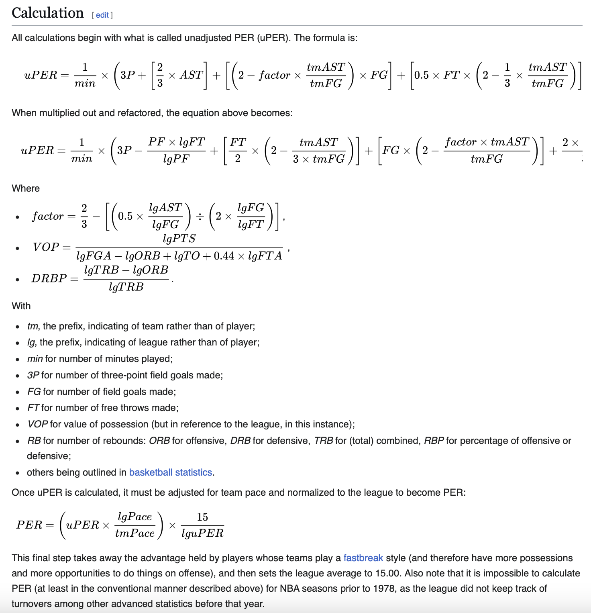
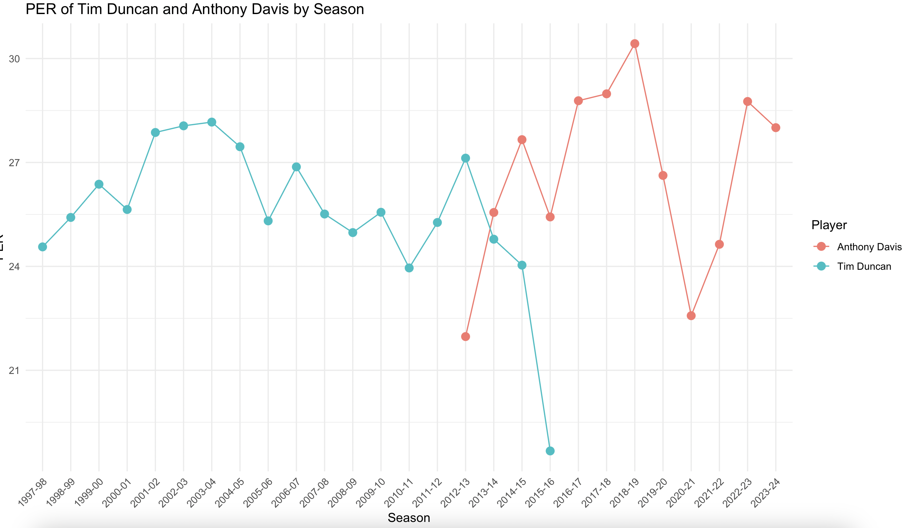

# Tim Duncan vs. Anthony Davis Analysis - "You Have No Idea How Good Tim Duncan Was"
https://youtu.be/7wd0ZTT4n9U?si=MBooBGdMpX-kU5Dj
## Table of Contents
- [Introduction](#introduction)
- [Methods and Technologies](#methods-and-technologies)
- [NBA Stats Aquisition](#Python-Script-for-NBA-Stats-Data-Aquisition)
- [Basic Stats](#Basic-Stats)
- [Shooting Analysis](#shooting-analysis)
- [Advanced Metrics](#advanced-metrics)
- [Conclusion](#conclusion)
- [Appendix](#appendix)

## Introduction
A video has started to go viral recently of a group of guys talking about basketball. One of them suggests that Anthony Davis is a better version of Tim Duncan, and almost immediately another guy yells out in pure disappointment, "You have no idea how good Tim Duncan was."

In this project I am going to try to prove that Tim Duncan is indeed better than that guy thought he was, using data analytics and statistical analysis.


## Methods and Technologies
**Methods Used:**
- Descriptive Statistics
- Inferential Statistics
- Data Visualization
- Predictive Modeling

**Technologies:**
- Python
- R
- pandas
- ggplot2

## Preface
"...now remove the points, lets talk just about their game - their offensive game. bro. Anthony Davis. 3 point shot, mid range, can put the ball on the floor, he can do turnarounds, he has some of the best footwork inside the NB-"

"YOU HAVE NO IDEA HOW GOOD TIM DUNCAN WAS OH MY GOD I CAN'T BELIEVE I AM HEARING THIS"

## Python Script for NBA Stats Data Aquisition 
To begin the analysis, I wrote a script called `StatGrab.py` to fetch and compile career statistics for all NBA players using the NBA API. This script retrieves player data, processes it, and saves the results to a CSV file. It also includes functionality to save progress periodically to avoid data loss in case of interruptions.


### Key Functions and Code Snippets

### Import Necessary Libraries
Imports the required libraries for data fetching and processing.

```python
from nba_api.stats.static import players 
from nba_api.stats.endpoints import playercareerstats
import pandas as pd
import time  # to prevent against hitting API limits
import os
```

### Get All Players
```python
# Get all players
all_players = players.get_players()
```

### Initialize Data Structures
```python
# Initialize an empty list to hold the data frames
all_players_stats = []

# Load progress if exists
if os.path.exists('progress.csv'):
    progress_df = pd.read_csv('progress.csv')
    processed_players = set(progress_df['PLAYER_ID'])
    all_players_stats.append(progress_df)
else:
    processed_players = set()

```
### Fetch Career Stats for Each Player
```python
# Loop through each player and get their career stats
for player in all_players:
    if player['id'] in processed_players:
        continue
    try:
        player_id = player['id']
        player_stats = playercareerstats.PlayerCareerStats(player_id=player_id).get_data_frames()[0]
        player_stats['PlayerName'] = player['full_name']
        player_stats['PLAYER_ID'] = player_id
        all_players_stats.append(player_stats)
        print(f"Retrieved stats for {player['full_name']}")

        total_processed = len(all_players_stats) - 1 + len(processed_players)
        percentage = int(total_processed / len(all_players) * 100)
        print("item: ", total_processed, "of", len(all_players), " ", percentage, "%")
        
        # Save progress periodically
        if len(all_players_stats) % 100 == 0:
            progress_df = pd.concat(all_players_stats, ignore_index=True)
            progress_df.to_csv('progress.csv', index=False)
            print("Progress saved")
        
        time.sleep(0.5)  # Increase sleep time to avoid rate limits
    except Exception as e:
        print(f"Could not retrieve stats for player {player['full_name']}: {e}")
        time.sleep(5)  # Wait longer before retrying
```

### Combine and Save Data
```python
# Combine all player stats into a single DataFrame
combined_stats = pd.concat(all_players_stats, ignore_index=True)

# Save the combined stats to a CSV file
combined_stats.to_csv('combined_stats.csv', index=False)

# Remove progress file after completion
if os.path.exists('progress.csv'):
    os.remove('progress.csv')
```

## Raw Data from NBA API
Example of raw data from the NBA API
 - This is just the first 2 lines of the raw data that I pulled from the API with `StatGrab.py` that I then use in the following section.

```csv
PLAYER_ID,SEASON_ID,LEAGUE_ID,TEAM_ID,TEAM_ABBREVIATION,PLAYER_AGE,GP,GS,MIN,FGM,FGA,FG_PCT,FG3M,FG3A,FG3_PCT,FTM,FTA,FT_PCT,OREB,DREB,REB,AST,STL,BLK,TOV,PF,PTS,PlayerName
76001,1990-91,0,1610612757,POR,23.0,43,0,290,55,116,0.474,0,0,0.0,25,44,0.568,27,62,89,12,4,12,22,39,135,Alaa Abdelnaby
```

# Basic Stats

I took the combined_stats.csv and imported it as a dataset into R. 


I designed an R script to analyze and visualize the basic statistics of NBA players, specifically focusing on Tim Duncan and Anthony Davis. The script processes the combined statistics data, calculates average statistics, and generates visualizations to compare the performances of these two players.

##  Key Functions and Code Snippets

### Import Necessary Libraries
```R
library(tidyverse)
library(dplyr)
library(ggplot2)
library(languageserver)
```

### Load and Prepare Data
```R
# Load progress data
progress_data <- read.csv("combined_stats.csv")

# Convert SEASON_ID to numeric and filter data from 1970 onwards
progress_data <- progress_data %>%
  mutate(SEASON_YEAR = as.numeric(substr(SEASON_ID, 1, 4))) %>%
  filter(SEASON_YEAR >= 1970)

# Filter data for Tim Duncan and Anthony Davis
tim_duncan_data <- progress_data %>%
  filter(PlayerName == "Tim Duncan")

anthony_davis_data <- progress_data %>%
  filter(PlayerName == "Anthony Davis")
```

### Calculate Average Stats
```R
# Calculate average PTS, BLK, STl, RED, and AST for all players
all_players_avg_stats <- progress_data %>%
  group_by(PlayerName, SEASON_ID) %>%
  summarize(
    avg_points = mean(PTS, na.rm = TRUE),
    avg_blocks = mean(BLK, na.rm = TRUE),
    avg_steals = mean(STL, na.rm = TRUE),
    avg_rebounds = mean(REB, na.rm = TRUE),
    avg_assists = mean(AST, na.rm = TRUE),
  )

# Add a column to distinguish Tim Duncan and Anthony Davis from other players
all_players_avg_stats <- all_players_avg_stats %>%
  mutate(highlight = case_when(
    PlayerName == "Tim Duncan" ~ "Tim Duncan",
    PlayerName == "Anthony Davis" ~ "Anthony Davis",
    TRUE ~ "Other"
  ))

all_players_avg_stats$SEASON_ID <- as.factor(all_players_avg_stats$SEASON_ID)
tim_duncan_data$SEASON_ID <- as.factor(tim_duncan_data$SEASON_ID)
anthony_davis_data$SEASON_ID <- as.factor(anthony_davis_data$SEASON_ID)
```

### Numerical Averages

## Tim Duncan's Average Stats per Season
- **Points:** 1394.53     
- **Assists:** 222.37
- **Rebounds:** 794.26
- **Blocks:** 158.9
- **Steals:** 53.95

## Anthony Davis's Average Stats per Season
- **Points:** 1328.7
- **Assists:** 141.6
- **Rebounds:** 590.33
- **Blocks:** 126.07
- **Steals:** 72.13


**Statistical Comparison**:
- This basic data (per season stat averages) shows Tim Duncan has slightly higher averages than Anthony Davis in points, assists, rebounds, and blocks - and AD leads in steals.
- It is crucial to understand that these are *career* averages. Duncan's later years significantly impacted his scoring average. As Duncan aged he took a step back from being an offensive force (not to say he couldn't still be one) and focused on defense, play-making, leadership, and mentoring younger players.
- Tim Duncan's rebound and block numbers also somewhat declined in his later years, but his defensive impact remained high throughout his career. Duncan's prime scoring averages would be notably higher than his career average.
- Davis, being younger, is much closer to his prime. His career averages are less diluted by a significant decline in production due to age. However, his averages will likely decrease as he ages.

## Visualization
```R
# Plot average points per season
ggplot() +
  geom_line(data = all_players_avg_stats %>% filter(highlight == "Other"), aes(x = SEASON_ID, y = avg_points, group = PlayerName), color = "grey", alpha = 0.5) + 
  geom_line(data = all_players_avg_stats %>% filter(highlight == "Tim Duncan"), aes(x = SEASON_ID, y = avg_points, group = PlayerName), color = "blue", size = 1.5) +
  geom_line(data = all_players_avg_stats %>% filter(highlight == "Anthony Davis"), aes(x = SEASON_ID, y = avg_points, group = PlayerName), color = "red", size = 1.5) +
  geom_text(data = tim_duncan_max_points, aes(x = SEASON_ID, y = avg_points, label = "Tim Duncan"), color = "blue", vjust = -1) +
  geom_text(data = anthony_davis_max_points, aes(x = SEASON_ID, y = avg_points, label = "Anthony Davis"), color = "red", vjust = -1) +
  labs(title = "Tim Duncan vs Anthony Davis", x = "Season", y = "Average Points per Season") +
  scale_color_manual(values = c("Tim Duncan" = "blue", "Anthony Davis" = "red", "Other" = "grey")) +
  theme_bw() +
  theme(axis.text.x = element_text(angle = 45, hjust = 1))
  ```

We can go further, however, and plot these averages and compare each player against each other, along with the rest of the NBA.

### Points Per Season


**Analysis**:
- Tim Duncan has a slightly higher average points per season compared to Anthony Davis.
- This reflects Duncan's consistent scoring ability throughout his career, even as his role evolved.

### Blocks Per Season


**Analysis**:
- Duncan's average blocks per season are higher than Davis's, showcasing his defensive prowess.
- Duncan's ability to protect the rim was a key aspect of his game.

### Rebounds Per Season


**Analysis**:
- Duncan also leads in rebounds per season, highlighting his dominance on the boards.
- His rebounding ability contributed significantly to his team's success.

### Steals Per Season


**Analysis**:
- Anthony Davis has a higher average in steals per season, indicating his versatility and defensive skills.
- Davis's ability to generate steals adds another dimension to his defensive game.

### Assists Per Season


**Analysis**:
- Duncan's assists per season are higher, reflecting his role as a facilitator in the Spurs' system.
- His playmaking ability was crucial in setting up his teammates for success.


## Key take away (Season averages)
- Duncan's career averages are a product of a long and highly successful career, including a period of decline in offensive output as he aged. This "dilution" is particularly noticeable in his scoring average.
- Davis's numbers are likely more representative of his prime, but it's important to remember that his career is still ongoing, and his stats could change significantly.

## Shooting Analysis
Now, I'm going to take a look at how each player performed when it came to making shots. I wrote a simple python script to compute some shooting meterics (eFG%, FG%, and TS%), and store them in a csv

```python
import pandas as pd

nba_data = pd.read_csv('../Stats_Data/combined_stats.csv')

# Calculate shooting metrics for all players
nba_data['eFG%'] = (nba_data['FGM'] + 0.5 * nba_data['FG3M']) / nba_data['FGA']
nba_data['FG%'] = nba_data['FGM'] / nba_data['FGA']
nba_data['TS%'] = nba_data['PTS'] / (2 * (nba_data['FGA'] + 0.44 * nba_data['FTA']))

# Save the results to a new CSV file
nba_data.to_csv('../Stats_Data/shooting_metrics.csv', index=False)
```

With this CSV, I moved to R and read in the data and plotted their per-season stats, along with the rest of the NBA since 1979 (when the 3 point line was added). The graphs were initially very ugly because of how many outliers there were but after cleaning it up (filtered out players who played < 20 games in a season) the graphs are pretty interesting, you can see the game shift towards prioritizing 3pt shooting

```R
# Filter data to include only seasons from 1979 onward (the year the 3-point line was introduced)
nba_data <- nba_data %>%
  filter(SEASON_ID >= "1979-80" & GP > 20)

highlight_players <- highlight_players %>%
  filter(SEASON_ID >= "1979-80" & GP > 20)
```

I again used ggplot2 to create the graphs, below is a snippet of how I set up each graph
```R
ggplot() +
  geom_line(data = nba_data %>% filter(!PlayerName %in% c("Tim Duncan", "Anthony Davis")), aes(x = SEASON_ID, y = `eFG%`, group = PlayerName), color = "grey", alpha = 0.5) +
  geom_line(data = highlight_players %>% filter(PlayerName == "Tim Duncan"), aes(x = SEASON_ID, y = `eFG%`, group = PlayerName), color = "blue", size = 1.5) +
  geom_line(data = highlight_players %>% filter(PlayerName == "Anthony Davis"), aes(x = SEASON_ID, y = `eFG%`, group = PlayerName), color = "red", size = 1.5) +
  geom_text(data = tim_duncan_midpoint, aes(x = SEASON_ID, y = `eFG%`, label = "Tim Duncan"), color = "blue", vjust = -1.5) +
  geom_text(data = anthony_davis_midpoint, aes(x = SEASON_ID, y = `eFG%`, label = "Anthony Davis"), color = "red", vjust = -1.5) +
  labs(
    title = "Effective Field Goal Percentage (eFG%) of NBA Players by Season",
    x = "Season",
    y = "Effective Field Goal Percentage (eFG%)"
  ) +
  theme_bw() +
  theme(axis.text.x = element_text(angle = 45, hjust = 1))
```

### Field Goal Percentage


This is the most basic of shooting statistics, the number of field goal makes out of their total field goal attempts

- Both Tim Duncan and Anthony Davis are consistently above the average of the league, as shown by the dense cluster of gray lines below them
- Tim Duncan maintains a remarkably consistant FG% throughout his career, whereas Anthony Davis has more variability
- Its important to note that as the league has changed, players are expected to take more shots from farther out and Anthony Davis has maintained a high FG% despite attempting more jump shots and 3-pointers than Duncan did
- That being said Duncan maintains a high FG% in his later years, demonstrating his ability to adapt and remain efficient as his athleticism declined


### Effective Field Goal Percentage


eFG% builds upon FG% by accounting for 3pt makes. It gives a more accurate representation of a player's shooting efficiency, especially in today's game where 3-point shooting is prevalent.
Formula: ((Field Goals Made) + 0.5 * (3-Point Field Goals Made)) / (Field Goal Attempts)

- In this graph shows the recent shift towards prioritizing the 3 point shot (the rising of the dense gray lines)
- Because Duncan rarely shot 3-pointers, his eFG% is very close to his FG%. The consistency shows his dominance in the paint.
- Davis also displays a high eFG% throughout his career, showcasing his overall scoring efficiency.
- Davis's eFG% is more influenced by his 3-point shooting compared to Duncan. This is because he attempts more 3s. The variability may reflect the inconsistency of his 3-point shot.
- We can see that as the league was changing Duncan kept dominating the paint and he remained an elite scorer

### True Shooting Percentage


This is the most comprehensive shooting efficiency statistic. It takes into account 2-point field goals, 3-point field goals, and free throws. It is a more complex formula, but it essentially measures how many points a player scores per shooting possession. 
Formula: (TS% = Points / (2 * (Field Goal Attempts + 0.44 * Free Throw Attempts)))

- Once again Tim Duncan's line has barely changes, putting is consistency and shooting efficiency on display
- Davis also displays a high TS%, comparable to Duncan's, showcasing his overall scoring efficiency.
- Additionally Davis's TS% is also influenced by his free throw shooting, which tends to be more consistent than Duncan's.

## Numerical Career Shooting Averages
```R
tim_duncan_career_avg <- highlight_players %>%
  filter(PlayerName == "Tim Duncan") %>%
  summarize(
    career_avg_efg = mean(`eFG%`, na.rm = TRUE),
    career_avg_fg = mean(`FG%`, na.rm = TRUE),
    career_avg_ts = mean(`TS%`, na.rm = TRUE)
  )

anthony_davis_career_avg <- highlight_players %>%
  filter(PlayerName == "Anthony Davis") %>%
  summarize(
    career_avg_efg = mean(`eFG%`, na.rm = TRUE),
    career_avg_fg = mean(`FG%`, na.rm = TRUE),
    career_avg_ts = mean(`TS%`, na.rm = TRUE)
  )
```
### Tim Duncan
- **eFG%:** 51%
- **FG%%:** 50%
- **TS%:** 55%

### Anthony Davis
- **eFG%:** 54%
- **FG%%:** 52%
- **TS%:** 59%

### Brief Analysis of Career Shooting Averages - Reliability vs. Versatility

#### Tim Duncan
- Foundation of Efficiency (FG%): Duncan's career was built on a rock-solid FG%. He was an incredibly accurate shooter, particularly inside. This was where he flourished – consistent, reliable scoring near the basket.

- Dominance in the paint (eFG%): Duncan's eFG% closely mirrors his FG%, and that tells a story. He didn't rely heavily on the 3-pointer, but he was so dominant in his scoring areas (post-ups, short jumpers) that his efficiency remained top-tier.

- Reliable Scoring Engine (TS%): Duncan's TS% underscores his overall dependability. He wasn't just a good field goal shooter, he was a highly efficient scorer. While his free throw shooting wasn't his strongest suit, his high FG% and consistent scoring made his TS% impressive and demonstrated his ability to score effectively in various ways.

#### Anthony Davis
- Versatile Accuracy (FG%): Davis showcases a high FG%, reflecting his ability to score inside and from midrange. His FG% speaks to his overall skill and touch around the basket.

- Modern Efficiency (eFG%): Davis's eFG% acknowledges his more modern style. He has a 3-point shot in his arsenal, which elevates his eFG% and showcases his ability to score efficiently in different ways. His eFG% illustrates his offensive versatility and efficiency in the contemporary NBA.

- Multi-Faceted Scoring (TS%): Davis's TS% emphasizes his diverse scoring toolkit. He's a scorer who gets points from field goals, 3-pointers, and free throws. His TS% reflects his ability to contribute points in various ways, making him a potent and efficient offensive threat


# II. Advanced Metrics 

Now I am going to go beyond the most basic stats of each player and gather a more nuanced view at each of their performances in the NBA.

## Player Efficiency Rating (PER)
The PlayerEfficiencyRating.py script is my first script designed to calculate advanced basketball metrics, specifically the Player Efficiency Rating (PER). PlayerEfficiencyRating.py calculates the PER score for any player using data from any NBA season that they played in.

### PER Formula Used

PER Formula Used
The unadjusted PER (uPER) formula used in the script is:

uPER = (PTS + FGM + FTM + FG3M + AST + REB + OREB + DREB + BLK + STL
        - (FGA - FGM) - (FTA - FTM) - TOV) / MIN

Where, 

- PTS = Points
- FGM = Field Goals Made
- FTM = Free Throws Made
- FG3M = Three-Point Field Goals Made
- AST = Assists
- REB = Total Rebounds
- OREB = Offensive Rebounds
- DREB = Defensive Rebounds
- BLK = Blocks
- STL = Steals
- FGA = Field Goals Attempted
- FTA = Free Throws Attempted
- TOV = Turnovers
- MIN = Minutes Played

Adjusted PER for pace,

adjusted_PER = uPER * (league_pace / team_pace)

and normalized to the league average,

normalized_PER = adjusted_PER * (15 / league_avg_PER)

( league_pace = Average number of possessions per 48 minutes for the league
  team_pace = Number of possessions per 48 minutes for the player's team
  league_avg_PER = Average PER for the league )

** more on this formula below

## Key Functions and Code Snippets

### get_player_id(player_name)
```python
def get_player_id(player_name):
    player_dict = players.get_players()
    for player in player_dict:
        if player['full_name'] == player_name:
            return player['id']
    return None
```
### fetch_player_gamelog(player_id, season)
```python
def fetch_player_gamelog(player_id, season):
    game_logs = playergamelog.PlayerGameLog(player_id=player_id, season=season)
    game_logs_df = game_logs.get_data_frames()[0]
    return game_logs_df
```

### fetch_league_stats(season)
```python
def fetch_league_stats(season):
    league_stats = leaguedashplayerstats.LeagueDashPlayerStats(season=season)
    league_stats_df = league_stats.get_data_frames()[0]
    return league_stats_df
```

### calculate_uPER(stats)
Calculates the unadjusted Player Efficiency Rating (uPER) based on aggregated player stats.
```python
def calculate_uPER(stats):
    # check for all columns 
    required_columns = ['PTS', 'FGM', 'FTM', 'FG3M', 'AST', 'REB', 'OREB', 'DREB', 'BLK', 'STL', 'FGA', 'FTA', 'TOV', 'MIN']
    for col in required_columns:
        if col not in stats:
            stats[col] = 0

    uPER = (stats['PTS'] + stats['FGM'] + stats['FTM'] + stats['FG3M'] + stats['AST'] + stats['REB'] + stats['OREB'] + stats['DREB'] + stats['BLK'] + stats['STL']
        - (stats['FGA'] - stats['FGM']) - (stats['FTA'] - stats['FTM']) - stats['TOV']) / stats['MIN']
    return uPER
```

### adjust_for_pace(uPER, team_pace, league_pace)
```python
# Function to adjust PER for pace (pace being the number of possessions per 48 minutes)
def adjust_for_pace(uPER, team_pace, league_pace):
    return uPER * (league_pace / team_pace)
```

### normalize_PER(uPER, league_avg_PER)
```python
def normalize_PER(uPER, league_avg_PER):
    return uPER * (15 / league_avg_PER)
```

### calculate_PER(player_name, season)
```python
# calculate PER for a player in a specific season
def calculate_PER(player_name, season):
    # Get player ID
    player_id = get_player_id(player_name)
    if not player_id:
        print(f"Player {player_name} not found")
        return
    
    # Fetch player game logs for the season
    game_logs = fetch_player_gamelog(player_id, season)
    
    # Aggregate the stats from the game logs
    aggregated_stats = game_logs[['PTS', 'FGM', 'FTM', 'FG3M', 'AST', 'REB', 'OREB', 'DREB', 'BLK', 'STL', 'FGA', 'FTA', 'TOV', 'MIN']].sum()
    
    # Calculate unadjusted 
    uPER = calculate_uPER(aggregated_stats)
    print(f"Unadjusted PER (uPER): {uPER}")

    # Fetch league stats for the season
    league_stats = fetch_league_stats(season)

    # Calculate league averages
    if 'PACE' in league_stats.columns:
        league_pace = league_stats['PACE'].mean()
    else:
        # Calculate league pace if not directly available (using formula: league_pace = ((FGA + 0.44 * FTA - OREB + TOV) / MIN).mean() * 48)
        league_pace = ((league_stats['FGA'] + 0.44 * league_stats['FTA'] - league_stats['OREB'] + league_stats['TOV']) / league_stats['MIN']).mean() * 48  # Assuming 48 minutes per game

    if 'PER' in league_stats.columns:
        league_avg_PER = league_stats['PER'].mean()
    else:
        # Calculate league average PER using available data (using formula: league_avg_PER = ((PTS + FGM + FTM + FG3M + AST + REB + OREB + DREB + BLK + STL - (FGA - FGM) - (FTA - FTM) - TOV) / MIN).mean())
        league_avg_PER = ((league_stats['PTS'] + league_stats['FGM'] + league_stats['FTM'] + league_stats['FG3M'] + league_stats['AST'] + league_stats['REB'] + league_stats['OREB'] + league_stats['DREB'] + league_stats['BLK'] + league_stats['STL']
            - (league_stats['FGA'] - league_stats['FGM']) - (league_stats['FTA'] - league_stats['FTM']) - league_stats['TOV']) / league_stats['MIN']).mean()

    print(f"League Pace: {league_pace}, League Avg PER: {league_avg_PER}")

    # Adjust and normalize PER 
    pace_adjusted_PER = adjust_for_pace(uPER, league_pace, league_pace)  
    normalized_PER = normalize_PER(pace_adjusted_PER, league_avg_PER)
    
    print(f"{player_name}'s PER: {normalized_PER}")

    # Save data to CSV files
    game_logs.to_csv(f"{player_name}_game_logs_{season}.csv", index=False)
```
## Accuracy
```python
# Example usage
calculate_PER('Tim Duncan', '2008-09')
calculate_PER('Russell Westbrook', '2016-017')
calculate_PER('Kevin Durant', '2016-17')
```
Calling the calculate_PER function on Tim Duncan, Russle Westbrook, and Kevin Durant in the specified seasons returned this:

.png)

And the offical Player Efficiency Rating each of them got for those seasons were:


and


The unadjusted Personal Efficiency Rating (uPER) formula is, in actuality, extremely comprehensive. I am using a simplified version here and because of that, my script isn't completely accurate. However, once adjusted and normalized, the PER that is returned is still very close to the official ratings. 

The comprehensive uPER formula, developed by John Hollinger:




## Results

Using my PlayerEfficiencyRating script, I calculated Tim Duncan and Anthony Davis's PER for each season that they were in the NBA, and stored the values in a csv. Then I moved to R and plotted the data.
```python
def calculate_PER_for_all_seasons(player_name):
    player_id = get_player_id(player_name)
    if not player_id:
        print(f"Player {player_name} not found")
        return
    
    # Fetch player career stats to get the seasons played
    career_stats = fetch_player_stats(player_id)
    seasons = career_stats['SEASON_ID'].unique()
    
    per_by_season = []
    for season in seasons:
        per = calculate_PER(player_name, season)
        if per is not None:
            per_by_season.append({'Season': season, 'PER': per, 'Player': player_name})
    
    return pd.DataFrame(per_by_season)

# Calculate PER for Tim Duncan and Anthony Davis
tim_duncan_per = calculate_PER_for_all_seasons('Tim Duncan')
anthony_davis_per = calculate_PER_for_all_seasons('Anthony Davis')

# Combine the results and save to CSV
combined_per = pd.concat([tim_duncan_per, anthony_davis_per])
combined_per.to_csv('tim_duncan_anthony_davis_per.csv', index=False)
```

```R
library(tidyverse)
library(dplyr)
library(ggplot2)
library(languageserver)

# Load the PER data
per_data <- read.csv("tim_duncan_anthony_davis_per.csv")

# Convert Season to a factor to ensure proper ordering in the plot
per_data$Season <- as.factor(per_data$Season)

# Plot the PER using a scatter plot
ggplot(per_data, aes(x = Season, y = PER, color = Player)) +
  geom_point(size = 3) +
  geom_line(aes(group = Player)) +
  labs(title = "PER of Tim Duncan and Anthony Davis by Season",
       x = "Season",
       y = "PER") +
  theme_minimal() +
  theme(axis.text.x = element_text(angle = 45, hjust = 1))
```



